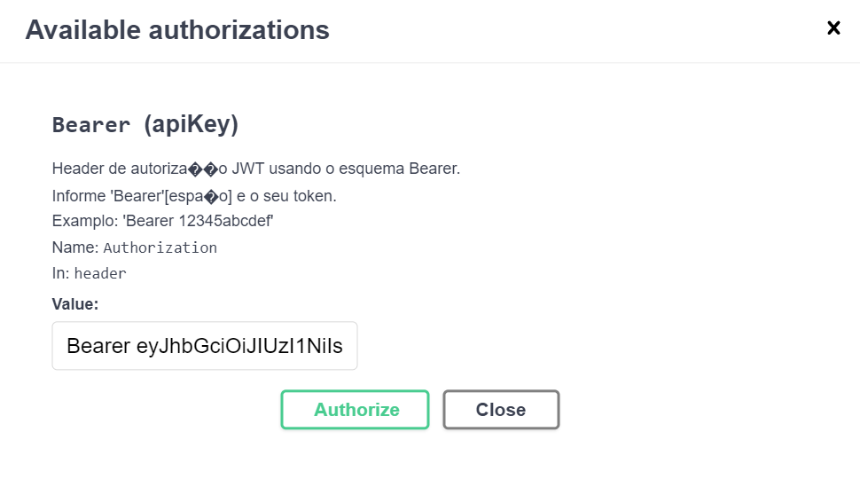
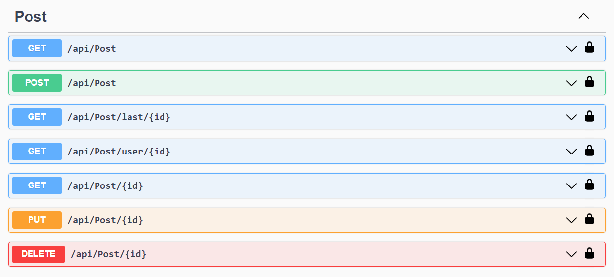
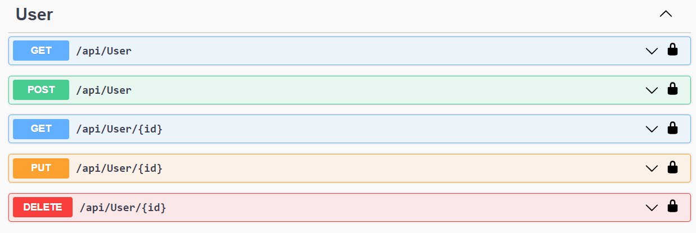

# Olá,  Bem vindo ao repositório do desafio Tryitter!</a>

## 🤔 O que esse projeto faz?
Este projeto foi desenvolvido para o Desafio Final da Aceleração de C# da Trybe em parceria com a XP, onde foi escolhido o Tryitter, que tem como objetivo proporcionar um ambiente em que as pessoas estudantes poderão, por meio de textos e imagens, compartilhar suas experiências e também acessar posts que possam contribuir para seu aprendizado, similar ao Twitter. 

O nosso time ficou responsável pelo backend da aplicação, que consiste em criar uma API REST desenvovida em C#, utilizando o ORM Entity Framework com validação de token JWT. Essa aplicação permite que o usuário se cadastre, consulte, atualize e delete seus dados e seus posts.
 
---

## 🤷🏽‍♀️ Como iniciar o projeto 

> 1. Clone o repositório: 
* `git clone git@github.com:Tryitter/Trybe.git`

> 2. Entre na pasta do repositório que você acabou de clonar: 
* `cd Trybe/Tryitter`

> 3. O banco de dados esta no docker então rode o serviço com o comando: 
* `docker-compose up -d`

> 4. Após subir o banco, utilize o comando abaixo para popular e inicializar nosso banco Tryitter:
* `dotnet ef database update`

> 5. Inicialize a aplicação com o comando:
* `dotnet run`

✨ **Atenção:** A aplicação roda nas portas 7029 e 5098, verifique se elas estão disponíveis e o banco de dados na porta padrão do MySQL 3306.

✨ **Atenção:** Após iniciar a aplicação utilize a rota `https://localhost:7029/swagger/index.html`, para testar a aplicação, lembrando que primeiro é necessário fazer o login para obter o token JWT, no corpo da requisição POST da rota `/api/Account/Login` utilize uma das contas cadastradas abaixo:

 ```json
  {
    "email": "carlos@carlos.com.br",
    "password": "12345678",
  }
```

 ```json
  {
    "email": "paolo@paolo.com.br",
    "password": "12345678",
  }
```
 ```json
  {
    "email": "luis@luis.com.br",
    "password": "12345678",
  }
```
✨ **Atenção:** Para autorizar as rotas passe o token da seguinte forma `Bearer token`, conforme a imagem a seguir:


---
## 👨‍💻 Vamos testar o projeto? 

Após o login e ter passado o token JWT você tem todas as rotas disponíveis para testar, então vamos começar pelo Post? Abaixo tem a imagem de todas as possibilidades que a rota do Post possui.

### POST


1. > A primeira rota que temos é a do método GET para retornar todos os posts realizados

2. > A segunda rota é para criar um novo post e para criar este novo post devemos passar os seguinte corpo:

```json
  {
    "titulo": "Titulo",
    "descricao": "Descrição do post",
    "imageUrl": "url da imagem",
    "dataPost": "2022-12-13T13:08:03.449Z", // data e hora do post
    "userId": 0 // Id do usuário que esta fazendo o post
  }
```

3. > A terceira rota é para verificar o último post de um usuário e para fazer isso deve ser passado o Id do usuário que desejamos visualizar o último post.

4. > A quarta rota é para verificar todos os post de um usuário específico, passando o Id deste usuário.

5. > A quinta rota é para verificar um post específico através de seu Id.

6. > A sexta rota serve para você editar um post, passando o Id deste post e passar o seguinte corpo

```json
  {
    "postId": 2,
    "titulo": "Novo Titulo",
    "descricao": "Nova descriação",
    "imageUrl": "url da imagem",
    "dataPost": "2022-12-13T13:24:23.217Z",
    "userId": 2 // id do usuario
  }
```

7. > A sétima e ultima rota serve para deletar um post específico passando o Id fo post que deseja excluir.

### USER
Agora vamos conhecer todas as rotas de usuários, segue a imagem das rotas disponíveis: 



1. > A primeira rota que temos é para retornar todos os usuários cadastrados.

2. > A segunda rota é para criar um novo usuário e para criar este novo usuário devemos passar os seguinte corpo:

```json
  {
    "name": "Novo usuário",
    "email": "email do novo usuário",
    "moduloAtual": "modulo que o usuário está",
    "statusPersonalizado": "Status",
    "password": "Senha"
  }
```

3. > A terceira rota serve para verificar um usário específico passando o Id.

4. > A quarta rota serve para editarmos um usuário passando o Id do usuário que vai ser editado e passando o seguinte corpo

```json
  {
    "name": "Novo nome",
    "email": "email",
    "moduloAtual": "O modulo atual",
    "statusPersonalizado": "Status do usuario",
    "password": "Senha"
  }
```

7. > E a quinta e última rota serve para deletar um usuário específico passando o Id do usuário que deseja excluir.
